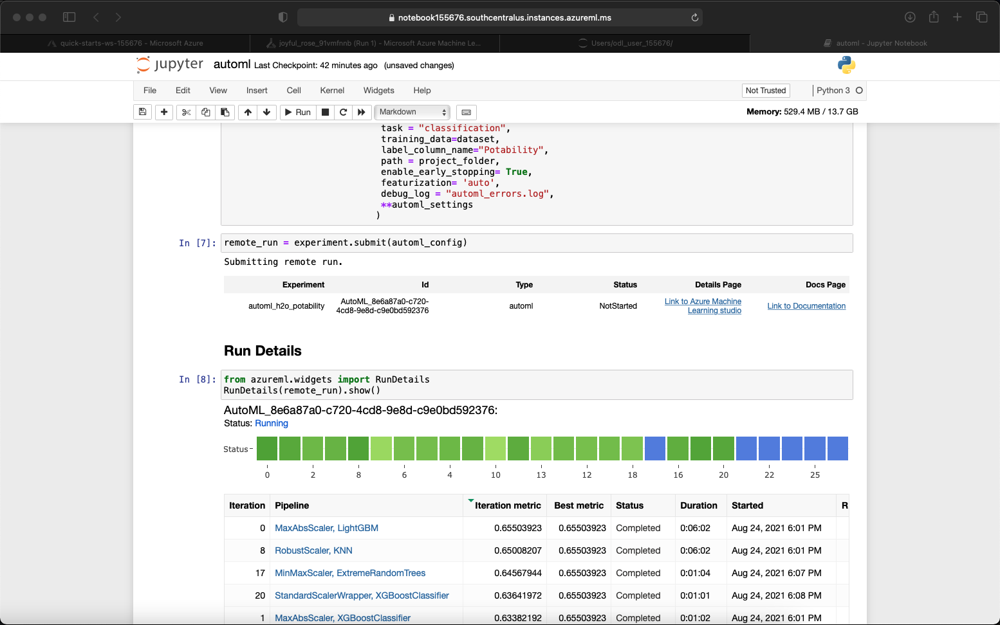
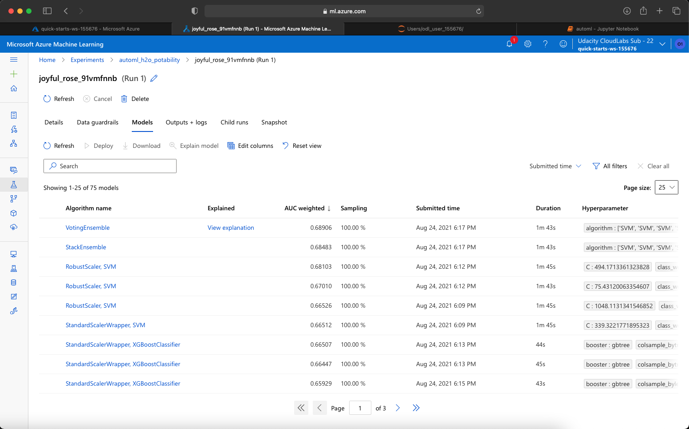
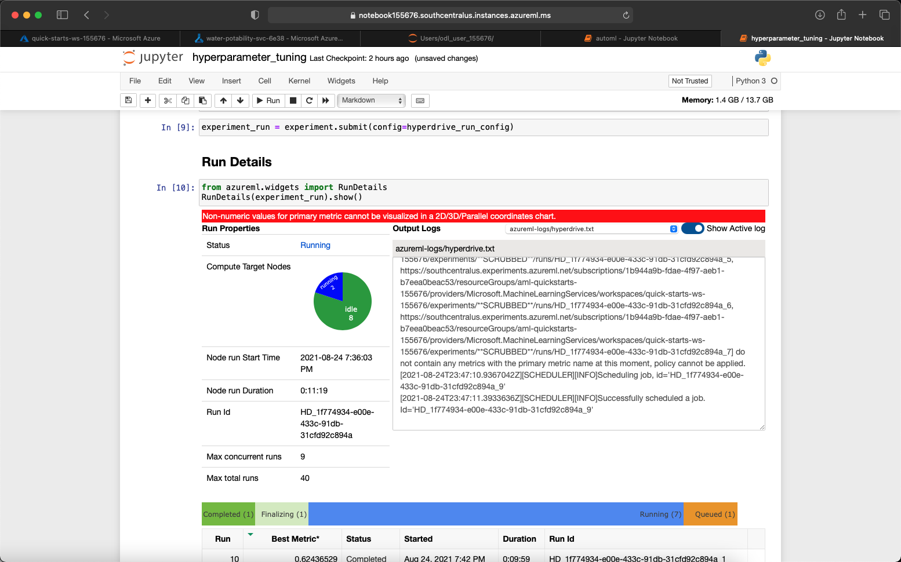
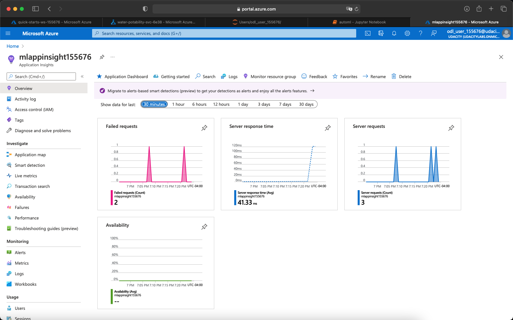

# Prediction of Water Potability using AutoML and HyperDrive

This project demonstrates how to use AutoML and HyperDrive to train models that predict water potability using an external dataset not directly availabled in AzureML.

The best model trained with AutoML and the best model trained with HyperDrive are compared using the highest AUC weighted metric, and the model with the best performance is deployed as a web service in an Azure Container Instance.

Once the best model is deployed, it is tested by making a web service call to predict water potability using a sample dataset.

This entire process is depicted in the following diagram:

## Project Set Up and Installation
To set up the project, we need to create a Compute Instance and open the Jupyter interface. In Jupyter, we need to upload the following files:
- automl.ipynb
- hyperparameter_tuning.ipynb
- train_randomforest.py

We need to also create a "data" folder, and upload the water_potability.csv file provided as part of this project.

## Dataset

### Overview
I am using the Water Potability dataset obtained from Kaggle: https://www.kaggle.com/nickyudin/waterpotability

This dataset was manually downloaded from Kaggle as a CSV file and it was stored in the data folder of the submission Zip file, and should also be uploaded in a "data" folder alongside (data folder at same level of) the Jupyter notebooks.

### Task
The water potability dataset contains 9 decimal columns that will be used as features for the model, and 1 integer column ("Potability") that will be the label or dependent variable to predict.

This will be a classification task as the model will predict the Potability variable which takes the value 0 (non-potable) or 1 (potable)

Features:
- pH
- Hardness
- Solids
- Chloramines
- Sulfate
- Conductivity
- Organic_carbon
- Trihalomethanes
- Turbidity

### Access
The water_potability.csv file needs to be uploaded to the "data" folder in the Compute Instance. A cell in any of the two Jupyter notebooks (automl.ipynb or hyperparameter_tuning.ipynb) will upload this data to the blob storage of the default dataset for the workspace and the dataset will be registered as a Tabular dataset sourced from the CSV file.

## Automated ML
An experiment was submitted by passing an AutoML configuration object that specified the task the model should perform ("classification"), the variable to predict ("Potability"), and the primary metric to consider to determine the best performing model ("AUC_weighted").

Other important settings included the compute target on which the experiment would run (a 10-node computer cluster previously defined in the notebook and registered in the AzureML workspace), maximum number of jobs to run in parallel (9 as I have a 10 node cluster), whether early stopping was enabled (true), and whether featurization was required (auto based on data). I also set a maximum of 60min for the experiment.

When inspecting the tasks of the AutoML experiment, I noticed that the data is imputed using the means, and I replicate this behavior on the HyperDrive experiment.

### Results

When submitting the AutoML experiment for execution, I could see details as the models were being trained by using the RunDetails widget as shown in the screenshot below:

Once the experiment completed, and addition to seeing the best run with the Run Details widget, I could also see it in the Experiments tab within the AzureML Workspace:

And clicking on the "Models" tab, we can look at the multiple models trained and their metrics:

The best performing model with AutoML had an AUC_weighted metric of 0.6890

As we can see, a VotingEnsemble classifier was the best performing model. We can retrieve it and take a look at the models that are part of the ensemble:

We can see that it uses 4 XGBoost classifiers and 5 Support Vector Machine classifiers.

Towards the bottom of the output, we can see the weights assigned to each of the models part of the ensemble:

We can also see some of this information in the Experiment UI:

## Hyperparameter Tuning
For Hyperparameter tuning, we train a specific model type and do it multiple times with different hyper parameters. For this exercise I used a Scikit-Learn RandomForestClassifier for its ability to handle complex relationships between the predictors and simplicity when it comes to interpreting the results. The script that trains the RandomForestClassifier with a given set of hyperparameter values is provided in the HyperDrive configuration (train_randomforest.py)

In a Random Forest Classifier, we train multiple decision trees and come up with a concensus with regards to the predictions. The number of trees (n_estimators) is a hyperparameter that was used for this HyperDrive experiment and value for each run is set to a random number between 50 and 300.

Another hyperparameter for Random Forests is the maximum depth the trees can reach (max_depth) and the value for this HyperDrive experiment is set to a random number between 20 and 50.

### Results
After submitting the HyperDrive experiment for execution, we could see progress of the job by using the RunDetails widget:

Each run int the screenshot above represents an execution of the train_randomforest.py script with a random values for the hyperparameters specified in the HyperDrive configuration.

Once the HyperDrive experiment completes, we can obtain the run with the best metric, which in this case is a Random Forest with 247 decision trees having a max depth of 21:

It is also very helpful to inspect the experiment in the "Child runs" section of the experiment run in the AzureML Workspace for a visual representation of the hyperparameters used and how they affected the AUC_weighted primary metric:

In the same view, we can also see the list of runs, their parameters, primary metric and additional run details:

The best performing random forest model with HyperDrive had an AUC_weighted metric of 0.63023

## Model Deployment
Given that the AutoML experiment yielded the best performing model, I proceeded to deploy it as a web service on an Azure Container Instance.

In order to do this, a scoring script, an Azure Container instance configuration, and an environment definition had to be provided (script and environment were passed as parameters when defining an inference configuration). 

After the web service is deployed, I could see it in the Endpoints section of the AzureML Workspace:

Once Azure Application Insights is enabled (and the web service is restarted), we can validate by looking at the "Application Insights url" in the endpoint details:

## Screen Recording
A screen recording explaining the source code and demonstrating the working model as a deployed web service can be accessed through the following link:

https://youtu.be/qQYJT813QeU

## Standout Suggestions
One of the standout suggestions to enable and use Azure Application Insights was performed for this project.

The following screenshot shows that the Application Insights was enabled on the Web Service:

And after submitting a web service call to predict the potability on the sample dataset, I could see that the activity was recorded in Azure Application Insights:

